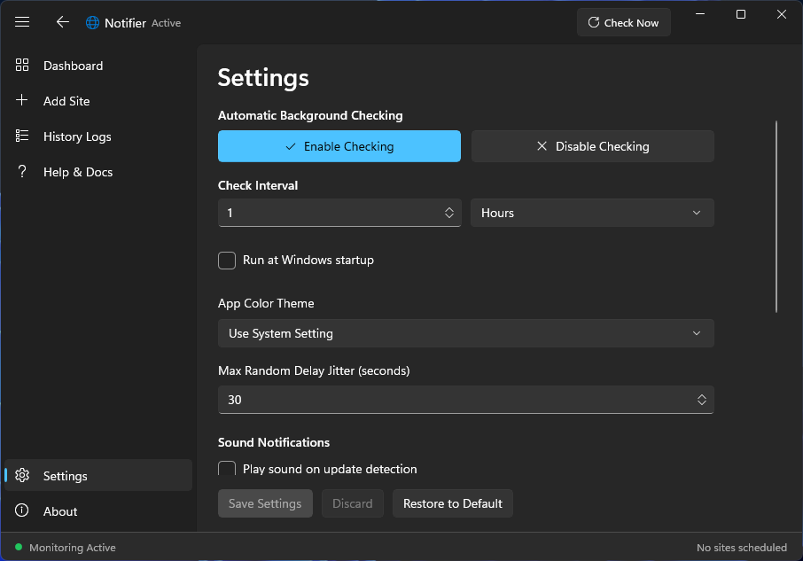

# 🔔 Site Update Notifier (Notifier)

[](https://github.com/ShadowAmitendu/Notifier/releases)
[](https://learn.microsoft.com/en-us/windows/apps/winui/winui3/)
[](https://dotnet.microsoft.com/en-us/apps/desktop)

A modern, high-performance Windows desktop utility built with C# and WinUI 3 (Windows App SDK) designed to monitor web page content changes and alert you instantly. Running unobtrusively in the system tray, Notifier is your personal agent for tracking site updates, documentation modifications, and price changes.

---

## 📸 Application Showcase

Here is a visual tour of the application interfaces:

<p align="center">
  
  
</p>
<p align="center">
  
  
</p>
<p align="center">
  
  
</p>

---

## ✨ Features

- **🔄 Real-time Site Monitoring:** Configure custom check intervals (in minutes or hours) and jitter values to prevent server detection.
- **🎨 Fluent Design UI:** Sleek modern interface conforming to the Windows 11 Fluent design language.
- **🌗 Custom Themes:** Support for Light Theme, Dark Theme, or System Default settings.
- **🔊 Custom Sound Notifications:** Configure a local `.mp3` or `.wav` audio alert to play whenever updates are detected.
- **📝 History Logs Pruning:** Keep settings files lightweight with auto-pruning (logs older than X days) or manual clearing.
- **🔍 Visual Diff Viewer:** Highlight modifications with a visual diff window showing additions (green) and deletions (red).
- **💾 Backup & Restore:** Import and export your monitored site lists and configurations to JSON backups.

---

## 🚀 Sideloading Installation Guide

Notifier is packaged as a secure Windows App package (`.msix`). Because it is self-signed, you must trust the developer's publisher certificate before Windows will let you install it.

### Step 1: Download Installer Files
Download the following two files from the [Latest Release](https://github.com/ShadowAmitendu/Notifier/releases/latest):
1. **`SiteUpdateNotifier.msix`** (App Installer)
2. **`NotifierPublisher.cer`** (Publisher Certificate)

### Step 2: Trust the Publisher Certificate

#### Method A: Using PowerShell (Fastest - Recommended)
1. Open PowerShell **as Administrator** (right-click and select "Run as Administrator").
2. Navigate to your downloads directory or specify the path to the certificate.
3. Run the following commands to add the certificate to your Windows Trust store:
   ```powershell
   Import-Certificate -FilePath .\NotifierPublisher.cer -CertStoreLocation Cert:\LocalMachine\Root
   Import-Certificate -FilePath .\NotifierPublisher.cer -CertStoreLocation Cert:\LocalMachine\TrustedPeople
   ```

#### Method B: Graphical User Interface (GUI)
1. Double-click the downloaded **`NotifierPublisher.cer`** file.
2. Click **Install Certificate...** in the dialog.
3. Select **Local Machine** as the Store Location and click **Next**.
4. Choose **Place all certificates in the following store**, click **Browse**, select **Trusted Root Certification Authorities**, and click **OK**.
5. Click **Next**, then click **Finish**.
6. Repeat the process but this time choose **Trusted People** as the store in step 4.

### Step 3: Run the Installer
Once trusted, double-click **`SiteUpdateNotifier.msix`** to install the application instantly!

---

## 🛠️ Development & Build Instructions

### Prerequisites
- [Visual Studio 2022](https://visualstudio.microsoft.com/) with the **.NET Desktop Development** and **Windows App SDK** workloads installed.
- [.NET 8 SDK](https://dotnet.microsoft.com/en-us/download/dotnet/8.0)

### How to Build
Clone the repository:
```bash
git clone https://github.com/ShadowAmitendu/Notifier.git
cd Notifier
```

Build the solution:
```bash
dotnet build -c Release
```

Generate packaged installer (`.msix`):
```powershell
powershell -ExecutionPolicy Bypass -File .\CreateMsix.ps1
```

---

## 📄 License
This project is licensed under the MIT License - see the LICENSE file for details.
